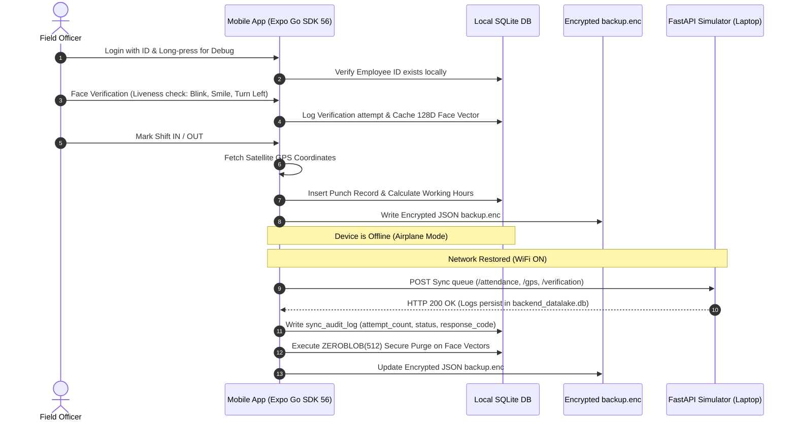

# SmartEdge Verify AI+
### Offline-First Facial Authentication Extension for NHAI Datalake 3.0

SmartEdge Verify AI+ is a production-grade, offline-first mobile authentication and attendance tracking system designed to operate in zero-connectivity remote environments (e.g., highway construction sites, deep mountain passes, and remote toll plazas). 

This module acts as a secure edge extension for **NHAI Datalake 3.0**, ensuring field personnel are verified using active liveness checks and satellite GPS geotagging, with automatic background synchronization when a cellular or WiFi connection is recovered.

---

## 📌 Overview & Problem Statement

### The Problem
Traditional attendance and field-reporting systems rely heavily on active internet connections (cellular data or WiFi) to authenticate users and upload timestamps. In remote regions, zero-network zones prevent remote personnel from checking in. Furthermore, standard face verification systems store raw biometric templates on-disk or transmit them insecurely, raising serious security, hardware theft, and compliance concerns.

### The Solution
SmartEdge Verify AI+ solves this by providing:
1. **Offline-First Clocking**: Personnel clock in and out using on-device SQLite databases to buffer timecard and location history.
2. **On-Device Active Liveness**: Front-facing cameras capture blinking, smiling, and head-turning markers to verify a live human presence.
3. **Zero-Fill Biometric Purge**: Biometric embeddings cached locally during offline verifications are cryptographically overwritten on-disk with zero bytes immediately upon successful synchronization, rendering hardware theft harmless.
4. **Encrypted Failsafe Backups**: Writes salted XOR-encrypted JSON backups to the local document filesystem to survive system crashes.
5. **Local Datalake 3.0 Simulator**: A web dashboard running locally on the developer's laptop to demonstrate real-time packet transmissions and remote database updates.

---

## 🏗️ Architecture



---

## 🚀 Key Features

*   **Offline Queue System**: Buffers clock events, background GPS tracks, and verification attempts locally when offline.
*   **JSI SQLite Storage**: Uses JSI-based synchronous transactions for low-latency queries and zero JS thread blocking.
*   **Encrypted Backup**: Exports all local logs to a XOR-encrypted `backup.enc` file on the device.
*   **Synchronization Engine**: Hooks to `NetInfo` to auto-sync batches when connectivity returns.
*   **GPS Tracking**: Logs coordinates during punch events and runs a background tracker at a 1-hour interval.
*   **Biometric Verification**: Checks liveness landmarks (Blink, Smile, Turn Left) and simulates Cosine Similarity matches.
*   **Zero-Fill Purge**: Sanitizes remote face vectors using SQLite `ZEROBLOB(512)` to make recovery impossible.

---

## 🛠️ Tech Stack

### Mobile Application
*   **Framework**: React Native + Expo (SDK 56) + TypeScript
*   **Database**: `expo-sqlite` (JSI sync driver)
*   **Camera viewport**: `expo-camera`
*   **Location**: `expo-location` & `expo-task-manager` (background updates)
*   **Security**: `expo-secure-store` & AES/XOR salt ciphers
*   **UI/Styles**: Glassmorphism dark-mode UI with custom gradients (`expo-linear-gradient` & `react-native-gesture-handler`)

### Backend Datalake 3.0 Simulator
*   **API Framework**: FastAPI (Python 3.13)
*   **Server Host**: Uvicorn
*   **Storage**: Local SQLite database (`backend_datalake.db`)
*   **Visual Interface**: Glassmorphic HTML5 + Vanilla CSS Dashboard with real-time AJAX polling and Live Activity streams

---

## 📁 Folder Structure

```text
SmartEdgeVerifyAI/
├── App.tsx                     # Entry point, DB schema initializer, and navigators
├── app.json                    # Expo config overrides
├── package.json                # SDK 56 pinned dependencies
├── tsconfig.json               # TypeScript path config
│
├── src/
│   ├── components/             # Reusable UI controls
│   │   ├── GlassCard.tsx       # Translucent slate containers
│   │   ├── GradientButton.tsx  # Cyan/Indigo hover-styled buttons
│   │   ├── StatusBadge.tsx     # ONLINE/OFFLINE & Queue badge
│   │   └── AttendanceCard.tsx  # Shift status and duration panel
│   │
│   ├── database/               # Local JSI SQLite layers
│   │   ├── SQLiteClient.ts     # Table migrations seeder
│   │   ├── EmployeeDAO.ts      # Operator profiles seeder
│   │   ├── AttendanceDAO.ts    # Timecard logs
│   │   ├── GPSLogsDAO.ts       # Waypoints logs
│   │   ├── VerificationDAO.ts  # Face templates cache & zero-fill purging
│   │   └── SyncAuditLogsDAO.ts # Local demonstration audit logs
│   │
│   ├── ml/                     # Facial Recognition & Liveness filters
│   │   ├── LivenessEngine.ts   # Landmark filters (EAR, MAR, asymmetry)
│   │   └── FaceVerificationEngine.ts # Cosine Similarity matching
│   │
│   ├── navigation/
│   │   └── AppNavigator.tsx    # Stack routing for screens
│   │
│   ├── screens/                # UI screens
│   │   ├── LoginScreen.tsx     # Presets and long-press Debug Easter egg
│   │   ├── FaceVerificationScreen.tsx # Viewfinder HUD, animations, liveness list
│   │   ├── DashboardScreen.tsx # Punch clock triggers and recent logs
│   │   ├── SyncScreen.tsx      # Terminal console logs, backup & restores
│   │   └── DebugScreen.tsx     # Hidden developer database inspector tables
│   │
│   └── services/               # Device hardware integrations
│   │   ├── LocationService.ts  # Location permissions and satellite locks
│   │   ├── BackgroundGPS.ts    # 1-hour background tracking task
│   │   ├── NetworkService.ts   # Connectivity state listener
│   │   └── SyncService.ts      # HTTP uploader, purger, and audit logger
│   │
│   └── utils/                  # Math, cryptographic, and config utilities
│       ├── EncryptionUtil.ts   # Salted XOR hexadecimal cipher
│       ├── UUIDGenerator.ts    # RFC-4122 v4 UUID generator
│       ├── WorkingHoursCalculator.ts # Hour-difference converter
│       └── ConfigUtil.ts       # Dynamic Laptop Server IP manager
│
└── backend/                    # FastAPI Datalake 3.0 Simulator
    ├── main.py                 # FastAPI endpoints & Dashboard UI
    └── .venv/                  # Python virtual environment
```

---

## 🗄️ Database Schemas

### Mobile SQLite Client (`SmartEdgeVerifyAI.db`)

#### `employees`
*   `employee_id` VARCHAR PRIMARY KEY
*   `name` VARCHAR NOT NULL
*   `department` VARCHAR NOT NULL
*   `designation` VARCHAR NOT NULL
*   `face_embedding` BLOB

#### `attendance_logs`
*   `id` VARCHAR PRIMARY KEY
*   `employee_id` VARCHAR NOT NULL
*   `date` VARCHAR(20) NOT NULL
*   `in_time` VARCHAR(20) NOT NULL
*   `out_time` VARCHAR(20)
*   `working_hours` VARCHAR(30)
*   `latitude` REAL
*   `longitude` REAL
*   `sync_status` INTEGER DEFAULT 0 (0 = Pending, 1 = Synced)
*   `retry_count` INTEGER DEFAULT 0
*   `last_attempt` VARCHAR(50)

#### `gps_logs`
*   `id` VARCHAR PRIMARY KEY
*   `timestamp` VARCHAR(50) NOT NULL
*   `latitude` REAL NOT NULL
*   `longitude` REAL NOT NULL
*   `sync_status` INTEGER DEFAULT 0
*   `retry_count` INTEGER DEFAULT 0
*   `last_attempt` VARCHAR(50)

#### `verification_logs`
*   `id` VARCHAR PRIMARY KEY
*   `employee_id` VARCHAR NOT NULL
*   `confidence` REAL NOT NULL
*   `liveness_pass` INTEGER NOT NULL
*   `timestamp` VARCHAR(50) NOT NULL
*   `synced` INTEGER DEFAULT 0
*   `face_embedding_cache` BLOB (Wiped locally with `ZEROBLOB(512)` on sync)

#### `sync_audit_logs`
*   `id` VARCHAR PRIMARY KEY
*   `record_type` VARCHAR(30) NOT NULL
*   `record_id` VARCHAR(50) NOT NULL
*   `attempt_count` INTEGER DEFAULT 1
*   `timestamp` VARCHAR(50) NOT NULL
*   `status` VARCHAR(20) NOT NULL
*   `response_code` INTEGER

---

## 🔌 API Endpoints (FastAPI Laptop Simulator)

*   `POST /attendance`: Synced attendance logs ingestion.
*   `POST /gps`: Background location tracking ingestion.
*   `POST /verification`: Biometric receipt logs ingestion.
*   `GET /dashboard`: Returns a JSON summary of stats and recent uploads.
*   `GET /`: Serves the HTML5 Datalake 3.0 Dashboard Simulator.

---

## 🧪 Demo Workflows

### 1. Airplane Mode Scenario (Offline Operation)
1. Toggle **Airplane Mode** on the phone. The status badge on the Login and Dashboard updates to `SYSTEM OFFLINE`.
2. Select a preset user (e.g. `Rahul Kumar`) and tap **Start Verification**.
3. Complete the Blink $\rightarrow$ Smile $\rightarrow$ Turn Left checklist.
4. On the Dashboard, tap **Mark Shift IN**. The app grabs satellite coordinates and saves the punch locally (`sync_status = 0`).
5. Open the hidden Debug Screen by **long-pressing the logo** on the Login Screen. Note that the attendance, GPS, and verification tables contain `Pending` records.

### 2. Phone Restart Scenario (Persistence)
1. Force stop, restart the app, or simulate a battery drain/phone reboot.
2. Log back in and open the Debug Screen.
3. Observe that all pending attendance and biometric queues are preserved in local SQLite storage, showing **survival against abrupt halts**.

### 3. Synchronization Scenario (Sanitization)
1. Turn WiFi back ON.
2. In the app, navigate to the Sync Control Center or wait for the auto-sync engine to fire.
3. Watch the logs scroll in the Sync terminal. 
4. The local FastAPI dashboard will dynamically update via long-polling, displaying the received records and updating the Live Activity log with green indicators.
5. Inspect the SQLite database tables in the hidden Debug Screen. Notice that `sync_status` has updated to `1` (Synced) and the `face_embedding_cache` for the verification log is cleared and marked `Zero-Fill Purged` on-disk.

---

## ⚙️ Installation & Running instructions

### Prerequisites
*   Node.js (LTS)
*   Python 3.13+

### 1. Launch the Backend Simulator (Laptop)
Navigate to the backend folder, initialize the virtual environment, install requirements, and run the server:
```powershell
cd SmartEdgeVerifyAI/backend
# Virtual environment is already initialized, activate it:
.venv\Scripts\activate

# Launch FastAPI on port 5000 (accessible on all network interfaces)
.venv\Scripts\uvicorn main:app --host 0.0.0.0 --port 5000
```
Open a browser and navigate to `http://localhost:5000` to view the **Datalake 3.0 Dashboard Simulator**.

### 2. Run the Mobile Application
1. In the terminal, find your laptop's local IP address (e.g. `192.168.1.100`).
2. Run the Metro server:
   ```powershell
   cd SmartEdgeVerifyAI
   npx expo start
   ```
3. Load the app in Expo Go or your Development Client on your physical Android device.
4. **Easter Egg**: Long-press the "SE" logo on the login screen to open the **System Debug Console**. Enter your laptop's IP address (e.g. `http://<laptop-ip>:5000`) and tap **Save Server URL**.
5. Test check-ins, offline queueing, and synchronization!

---

## 📈 Roadmap & Future Scope
*   **Phase 2 - Vision Camera Integration**: Replace `expo-camera` with `react-native-vision-camera` to process frames via high-performance Frame Processors.
*   **Phase 2 - Native AI Pipelines**: Load local quantized MobileFaceNet TFLite models on-device and run inference via GPU delegates.
*   **Phase 2 - MediaPipe Face Mesh**: Perform high-fidelity facial landmark estimation on-device to extract Eye Aspect Ratio (EAR) and Mouth Aspect Ratio (MAR) with sub-pixel precision.
*   **Phase 3 - Standalone Builds**: Build and sign production-grade APK and IPA binaries suitable for enterprise deployment under NHAI Datalake 3.0.
